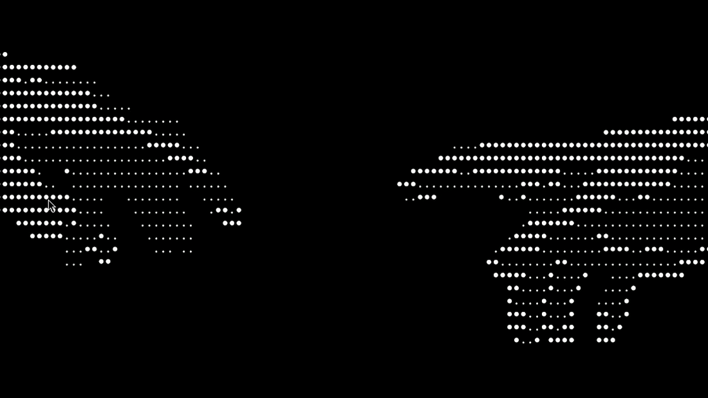

# omarchy-claude-code

Keyboard-first launchers for [Claude Code](https://claude.com/claude-code) on
[Omarchy](https://omarchy.org/).

Omarchy already ships an agent binding (`SUPER + SHIFT + CTRL + A`) that opens
whichever agent you picked in the menu. This adds the three things that binding
does not do: a scratchpad you can drop over any workspace, a launcher that
focuses the session you already have open, and a project picker.



Everything routes through Omarchy's own `omarchy-agent`, so it respects the
agent you selected in **Setup → Default Agent** and the flags Omarchy launches
it with. Nothing here talks to `claude` directly.

## Keys

| Key | What it does |
|---|---|
| `SUPER + A` | Claude scratchpad — a session on its own special workspace, toggled over whatever is on screen |
| `SUPER + SHIFT + A` | Open Claude Code, or focus the window that is already open |
| `SUPER + ALT + A` | Pick a project from a centered popup, open Claude Code in it |

`SUPER + SHIFT + CTRL + A` keeps working; this does not replace it.

## The picker

`SUPER + ALT + A` opens a small floating window with an fzf list of your
projects, most recently touched first, with a preview pane showing the last
commits (or the file list, for a folder that is not a repo).

Press enter and the popup untiles itself and becomes the session — one window,
no second launch.

`ctrl-e`, or the `⚙ project folders…` row, opens the folder list:

```
~/.config/omarchy/claude-projects
```

One folder per line, `#` for comments, `~` expanded. Every subdirectory inside
a listed folder counts as a project. The default is `~/Projects` and `~/Work`.

## The menu

The Omarchy menu gets a **Claude Code** entry with the scratchpad, a
**Refresh projects** row, and your projects as rows. Search it with `claude`.

The menu's plugin API only runs Omarchy's own built-in providers, so the project
rows are written into `omarchy-menu.jsonc` as plain rows by
`claude-projects-sync`. Run that (or the menu row) after adding a project.

## Install

```bash
git clone https://github.com/furkaanasik/omarchy-claude-code
cd omarchy-claude-code
./install.sh
```

Needs Omarchy, `fzf` and `jq`. Safe to re-run: everything it writes into your
config sits between `omarchy-claude-code` markers and is replaced in place.

It touches four things:

- `~/.local/bin/` — the five scripts
- `~/.config/hypr/bindings.lua` — the three bindings
- `~/.config/hypr/hyprland.lua` — window rules for the scratchpad and the popup
- `~/.config/omarchy/extensions/omarchy-menu.jsonc` — the menu rows

`SUPER + SHIFT + A` is ChatGPT's web app in a stock Omarchy install, so the
installer unbinds it first — unless your config already did.

## Uninstall

```bash
./uninstall.sh           # keeps your folder list
./uninstall.sh --purge   # removes it too
```

## Scripts

| Script | |
|---|---|
| `claude-in [dir]` | open the agent in a directory (default `~/Projects`) |
| `claude-pick` | the project picker |
| `claude-pad` | toggle the scratchpad |
| `claude-projects-list` | print project directories, newest first |
| `claude-projects-sync` | regenerate the menu rows |

## Notes for anyone hacking on this

Two Omarchy behaviours shaped the design:

- `uwsm-app` hands launches to `wayland-wm-app-daemon`, so a launched terminal
  does **not** inherit the caller's working directory. The directory is passed
  as `bash -lc "cd … && exec …"` instead. Keep those commands on one line: the
  daemon protocol is line based, and a multi-line command wedges it until
  `systemctl --user restart wayland-wm-app-daemon.service`.
- Launching a second window from inside a window the daemon has just launched is
  fragile. That is why the picker untiles itself and execs the agent in place
  rather than spawning a separate session window.

## License

MIT
